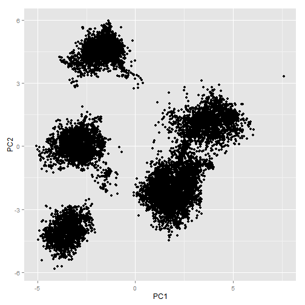

### Background

Using devices such as Jawbone Up, Nike FuelBand, and Fitbit it is now possible to collect a large amount of data about personal activity relatively inexpensively. These type of devices are part of the quantified self movement - a group of enthusiasts who take measurements about themselves regularly to improve their health, to find patterns in their behavior, or because they are tech geeks. One thing that people regularly do is quantify how much of a particular activity they do, but they rarely quantify how well they do it. In this project, your goal will be to use data from accelerometers on the belt, forearm, arm, and dumbell of 6 participants. They were asked to perform barbell lifts correctly and incorrectly in 5 different ways. More information is available from the website here: http://groupware.les.inf.puc-rio.br/har

The course project asked to perform a supervised machine learning algorithm, to classify the people based on their activity. This data contains 19622 observations of 160 varaibles, so doing exploratory data analysis might not work. The major part of project is cleaning this data, finding a much smaller representation of the data using principal component analysis and then running a predictive model like Random forests, or Boosting. It was observed that the Random forests algorithm worked great on this dataset and reached an accuracy of 97.9. It was able to classify the holdout test dataset perfectly. This report shows some of the preprocessing steps, and model building. 


A comment shall be made on the nature of the study performed in this report, the group of avtivities belonging to class A are the ones who are doing the exercise properly. Remaining classes are the incorrect ways of doing the exercise. Using Random forests, we were able to predict their class based on the sensor data. With the IoT revolution, applications like this are going to play a huge role in the near future.

## Preprocessing the data
### Reading the data

```r
df <- read.csv(file = "train.csv", header = TRUE)
#str(df) Lots of NA's and blank values!
```
### Test-Train Split

```r
require(caret)
trainIndex <- createDataPartition(df$classe, p= 0.7, list = FALSE)
trainData <- df[trainIndex,]
testData <- df[-trainIndex,]
```
### Cleaning the dataset

```r
# Removing columns with index variables
clean <- grep("name|timestamp|window|X", colnames(trainData))
trainData <- trainData[, -clean]
# Removing columns with more than 95% NA's
goodColumns <- !apply(trainData, 2,
                      function(x) sum(is.na(x)) > (dim(trainData)[1]) * 0.95 || 
                        sum(x=="") > length(dim(trainData)[1]) * 0.95)
trainingClean <- trainData[,goodColumns]
# Same for the test data
testData <- testData[, -clean]
goodColumnsTest <- !apply(testData, 2,
                      function(x) sum(is.na(x)) > (dim(testData)[1]) * 0.95 || 
                        sum(x=="") > length(dim(testData)[1]) * 0.95)
testDataClean <- testData[, goodColumnsTest]
```

We still have a whooping 52 columns of data without consdering the response variable. Most of them are either integer or continous variables, so we can actually do principal component analysis and reduce it. We'll build a PCA capturing 95% variance in the data. This step improves the performance of the algorithm.


```r
trainDataPCA <- preProcess(trainingClean[,1:52], method = "pca", thresh = 0.95)
# PCA needed 25 components to capture 95 percent of the variance
# Important, apply the same train PCA on the test data!
# Exclude the response variable!
trainPCA <- predict(trainDataPCA, trainingClean[,1:52])
testPCA <- predict(trainDataPCA, testDataClean[,1:52])
```

## Machine Learning models
Now comes the fun stuff, we have 25 components of cleaned data. Let's just run a random forest. Quickly realized that it is very slow. We have to make it fast. 

```r
library(parallel)
library(doParallel)
# I have a four core i7, but it's a laptop so giving it only four threads.
cl <- makeCluster(detectCores() - 4)
registerDoParallel(cl)
ctrl <- trainControl(classProbs=TRUE,
                     savePredictions=TRUE,
                     allowParallel=TRUE)
```
### Models

```r
set.seed(11)
# model1 <- train(classe ~ ., data=trainPCA, method="gbm")
model2 <- train(classe ~ ., data=trainPCA, method="rf")
```

## Prediction on test data

```r
require(caret)
load(file = "randomModel.rda")
testPCA$predictrf <- predict(model2, testPCA[,1:25])
confusionMatrix(testData$classe, testPCA$predictrf)
```

## Confusion matrix and accuracy

```r
Confusion Matrix and Statistics

          Reference
Prediction    A    B    C    D    E
         A 1660    7    5    2    0
         B   15 1105   19    0    0
         C    3   10 1008    4    1
         D    1    1   36  923    3
         E    0    4    8    4 1066

Overall Statistics
                                          
               Accuracy : 0.9791          
                 95% CI : (0.9751, 0.9826)
    No Information Rate : 0.2853          
    P-Value [Acc > NIR] : < 2.2e-16       
                                          
                  Kappa : 0.9736          
 Mcnemars Test P-Value : NA              

Statistics by Class:

                     Class: A Class: B Class: C Class: D Class: E
Sensitivity            0.9887   0.9805   0.9368   0.9893   0.9963
Specificity            0.9967   0.9929   0.9963   0.9917   0.9967
Pos Pred Value         0.9916   0.9701   0.9825   0.9575   0.9852
Neg Pred Value         0.9955   0.9954   0.9860   0.9980   0.9992
Prevalence             0.2853   0.1915   0.1828   0.1585   0.1818
Detection Rate         0.2821   0.1878   0.1713   0.1568   0.1811
Detection Prevalence   0.2845   0.1935   0.1743   0.1638   0.1839
Balanced Accuracy      0.9927   0.9867   0.9665   0.9905   0.9965
```
### Testing on the holdout data set

```r
df_test <- read.csv("test.csv", header = TRUE)
df_clean <- df_test[, -clean]
goodColumnsDF <- !apply(df_clean, 2,
                      function(x) sum(is.na(x)) > (dim(df_clean)[1]) * 0.95 || 
                        sum(x=="") > length(dim(df_clean)[1]) * 0.95)
testClean <- df_clean[, goodColumnsDF]
testCleanPCA <- predict(trainDataPCA, testClean[,1:52])
testCleanPCA$predict_rf <- predict(model2, testCleanPCA[,1:25])
answers = testCleanPCA$predict_rf
pml_write_files = function(x){
  n = length(x)
  for(i in 1:n){
    filename = paste0("problem_id_",i,".txt")
    write.table(x[i],file=filename,quote=FALSE,row.names=FALSE,col.names=FALSE)
  }
}
```
### Conclusion
 It was observed that the Random forests algorithm worked great on this dataset and reached an accuracy of 97.9. It was able to classify the holdout test dataset perfectly. 
 
## Appendix
### Trying to visualize PCA

```r
require(ggplot2)
require(caret)
pcaex <- preProcess(trainingClean[,1:52], method = "pca", thresh = 0.7)
pcaEx <- predict(pcaex, trainingClean[,1:52])
qplot(x= PC1, y= PC2, data = pcaEx)
```

 
