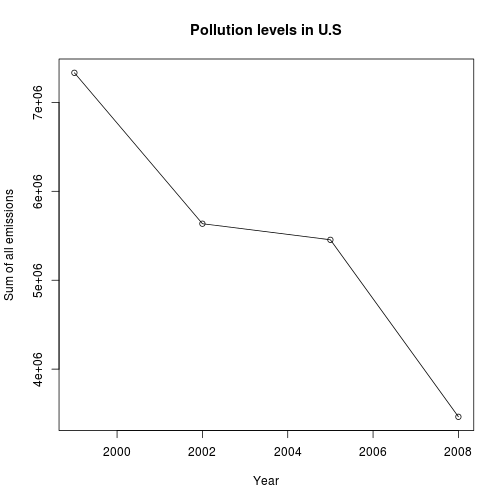
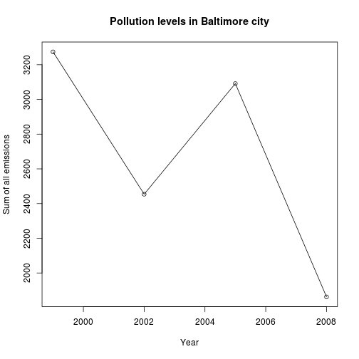
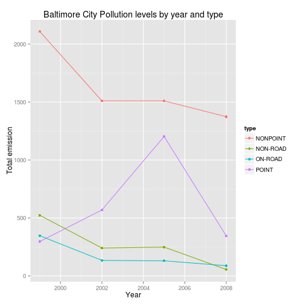
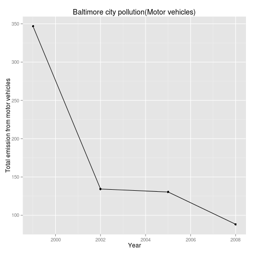
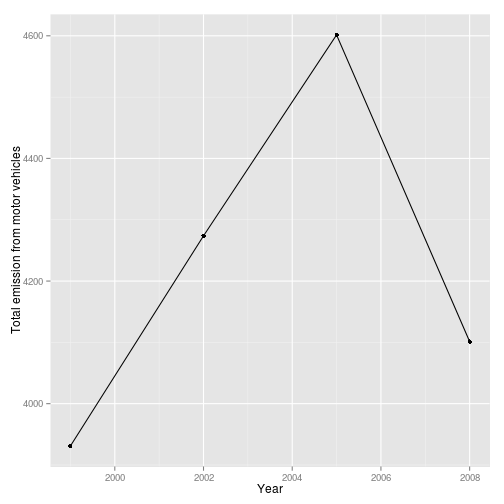
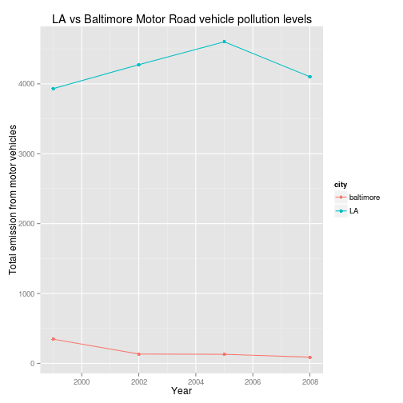

## Downloading data


```r
#fileUrl <- "https://d396qusza40orc.cloudfront.net/exdata%2Fdata%2FNEI_data.zip"
#download.file(fileUrl, destfile = "./data/data.zip")
#unzip("data.zip")
library(ggplot2)
library(dplyr)
```

### Reading them into files


```r
clscode <- readRDS("./data/Source_Classification_Code.rds")
summarypm2.5 <- readRDS("./data/summarySCC_PM25.rds")
```

1. Have total emissions from PM2.5 decreased in the United States from 1999 to 2008? Using the base plotting system, make a plot showing the total PM2.5 emission from all sources for each of the years 1999, 2002, 2005, and 2008.

Yes they did decrease.


```r
summary.by.year <- aggregate(Emissions ~ year, data = summarypm2.5, FUN = sum)
# png("./q1.png")
plot(summary.by.year, xlab = "Year", ylab="Sum of all emissions", main = "Pollution levels in U.S")
lines(summary.by.year)
```

 

```r
# dev.off()
```


2. Have total emissions from PM2.5 decreased in the Baltimore City, Maryland (fips == "24510") from 1999 to 2008? Use the base plotting system to make a plot answering this question.

Yes, they did.


```r
baltimore <- filter(summarypm2.5, fips == "24510") %>%  
                                    group_by(year) %>%
                                      summarise(sum(Emissions))
#png("./q2.png")
plot(baltimore, xlab = "Year", ylab="Sum of all emissions", main = "Pollution levels in Baltimore city")
lines(baltimore)
```

 

```r
#dev.off()
```

3. Of the four types of sources indicated by the type (point, nonpoint, onroad, nonroad) variable, which of these four sources have seen decreases in emissions from 1999–2008 for Baltimore City? Which have seen increases in emissions from 1999–2008? Use the ggplot2 plotting system to make a plot answer this question.


```r
baltimore.data <- filter(summarypm2.5, fips == "24510") %>% 
                                  group_by(year, type) %>%
                                  summarise(sum(Emissions))
#png("q3.png")

qplot(x= baltimore.data$year, y= baltimore.data$`sum(Emissions)`,
      data = baltimore.data, color= type,
      geom = c("line","point"), xlab = "Year", ylab = "Total emission", main = "Baltimore City Pollution levels by year and type")
```

 

```r
#dev.off()
```
4. Across the United States, how have emissions from coal combustion-related sources changed from 1999–2008?


5. How have emissions from motor vehicle sources changed from 1999–2008 in Baltimore City?

It's impressive, they decreased.


```r
baltimore.road <- filter(summarypm2.5, fips == "24510", type== "ON-ROAD") %>% 
  group_by(year) %>%
  summarise(sum(Emissions))
# Plotting data
#png("./q5.png")
qplot(x= baltimore.road$year, y=baltimore.road$`sum(Emissions)`, geom = c("line","point"),
          xlab= "Year", ylab= "Total emission from motor vehicles", main = "Baltimore city pollution(Motor vehicles)")
```

 

```r
#dev.off()
```

6. Compare emissions from motor vehicle sources in Baltimore City with emissions from motor vehicle sources in Los Angeles County, California (fips == "06037"). Which city has seen greater changes over time in motor vehicle emissions

I think what LA managed to do here is nothing short of incredible. They decreased their consumption way beyod the competition.


```r
la.road <- filter(summarypm2.5, fips == "06037", type == "ON-ROAD") %>%
              group_by(year)  %>%
                      summarise(sum(Emissions))
qplot(x= la.road$year, y=la.road$`sum(Emissions)`, geom = c("line","point"),
      xlab= "Year", ylab= "Total emission from motor vehicles")
```

 

```r
# Plotting both graphs in the same window
la.road$city <- "LA"
baltimore.road$city <- "baltimore"
complete <- rbind(la.road, baltimore.road)
#png("./q6.png")
qplot(x= complete$year, y= complete$`sum(Emissions)`, geom = c("line","point"),
      xlab = "Year", ylab= "Total emission from motor vehicles", color= city, 
      data = complete, main = "LA vs Baltimore Motor Road vehicle pollution levels")
```

 

```r
#dev.off()
```
