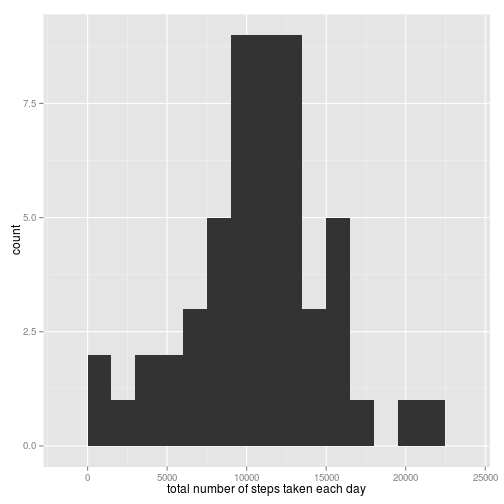
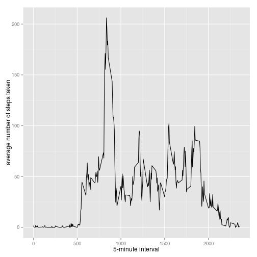
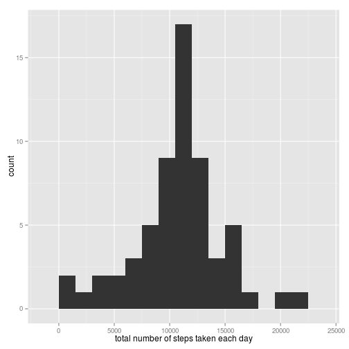
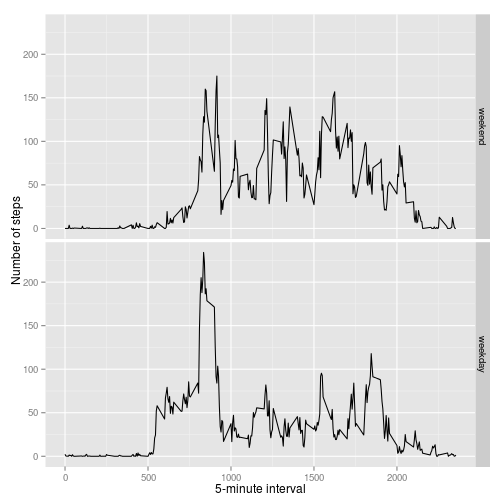

## Loading and preprocessing the data

The data for this assignment are from one of the fitness bands that a lot of people use these days. The main aim of the assignment is to introduce reproducible research using R and knitr packages. Initially, I am going to download the data and unzip it using these commands in R:


```r
unzip("./repdata-data-activity.zip")
# Read file into a dataframe
df <- read.csv("./activity.csv")
```

## What is mean total number of steps taken per day?


```r
# We will be using packages from Hadley Wickham just because they are super cool.
require(ggplot2)
```

```r
require(ggplot2)
```


Let's put our newly loaded dplyr package to some use. The aggregate function is a time saver when compared with the tedious subsetting in base-R package. We are trying to the mean of total steps taken per each day.


```r
averages <- aggregate(steps ~ date, data = df, sum)
```


Now, we have our averages. Let's plot them.

```r
qplot(averages$steps, binwidth = 1500, xlab = "total number of steps taken each day")
```

 

Let's also find out the mean and median of our newly aggregated data.

```r
mean(averages$steps)
```

```
## [1] 10766.19
```

```r
median(averages$steps)
```

```
## [1] 10765
```

## What is the average daily activity pattern?

We are now trying to understand the where the user is doing most of the work in. For that, it's better to take an aggregate over all the days:


```r
timeseries <- aggregate(x = list(steps = df$steps), by = list(interval = df$interval), FUN = mean, na.rm = TRUE)
str(timeseries)
```

```
## 'data.frame':	288 obs. of  2 variables:
##  $ interval: int  0 5 10 15 20 25 30 35 40 45 ...
##  $ steps   : num  1.717 0.3396 0.1321 0.1509 0.0755 ...
```
Here is a plot of the timeseries using ggplot2.

```r
ggplot(data = timeseries, aes(x = interval, y = steps)) + geom_line() + xlab("5-minute interval") + 
    ylab("average number of steps taken")
```

 

Let's take a look at that largest point on the graph.


```r
timeseries[which.max(timeseries$steps), ]
```

```
##     interval    steps
## 104      835 206.1698
```
## Imputing missing values

We do have a lot of missing values in our dataset, it is reasonable to repalce them with the average over all days during that particular interval. Let's check NA's in our original dataframe.

```r
nas <- is.na(df$steps)
summary(nas)
```

```
##    Mode   FALSE    TRUE    NA's 
## logical   15264    2304       0
```


We already have the averages calculated in the timeseries dataframe, so we just need to find a method to replace them:


```r
replacer <- function(steps, interval) {
    filled <- NA
    if (!is.na(steps)) 
        filled <- c(steps) else filled <- (timeseries[timeseries$interval == interval, "steps"])
    return(filled)
}
filled.data <- df
filled.data$steps <- mapply(replacer, filled.data$steps, filled.data$interval)
str(filled.data)
```

```
## 'data.frame':	17568 obs. of  3 variables:
##  $ steps   : num  1.717 0.3396 0.1321 0.1509 0.0755 ...
##  $ date    : Factor w/ 61 levels "2012-10-01","2012-10-02",..: 1 1 1 1 1 1 1 1 1 1 ...
##  $ interval: int  0 5 10 15 20 25 30 35 40 45 ...
```

Let's make a histogram.

```r
timeseries.new <- aggregate(steps ~ date, data = filled.data, sum)
qplot(timeseries.new$steps, binwidth = 1500, xlab = "total number of steps taken each day")
```

 

Now,let's try to poke at the mean and median of the new timeseries. We can guess that it would change, but we are hoping that it won't change too much.


```r
mean(timeseries.new$steps)
```

```
## [1] 10766.19
```

```r
median(timeseries.new$steps)
```

```
## [1] 10766.19
```

Oh, the mean and median are higher. I have replaced the NA's in the original data with the mean from all the days, so it is expected to increase.

## Are there differences in activity patterns between weekdays and weekends?

I'm hoping to use the weekdays() function to try to predict if there are changes in activites in weekdays vs weekends.


```r
df$date <- as.Date(df$date)
weekdays <- c('Monday', 'Tuesday', 'Wednesday', 'Thursday', 'Friday')
df$wDay <- factor((weekdays(df$date) %in% weekdays), 
                   levels=c(FALSE, TRUE), labels=c('weekend', 'weekday') )
```

Let's aggregate those averages again.

```r
averages.sep <- aggregate(steps ~ interval + wDay, data = df, mean)
ggplot(averages.sep, aes(interval, steps)) + geom_line() + facet_grid(wDay ~ .) + xlab("5-minute interval") + ylab("Number of steps")
```

 
